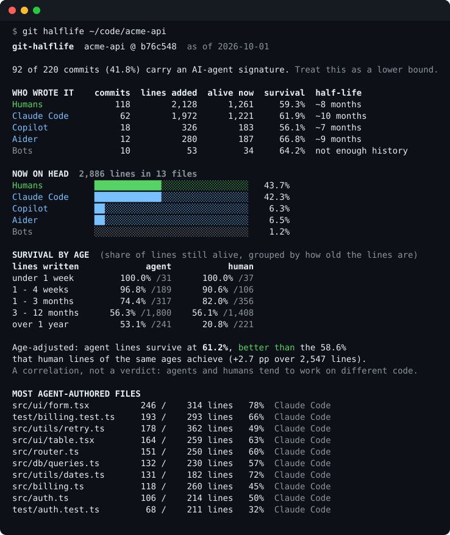

<div align="center">

# git-halflife

**How long does AI-written code actually survive in your repo?**

Retroactive, offline, line-level survival analysis straight from your git history. No hooks to install, no API keys, nothing leaves your machine.

[](https://github.com/Nithinfgs/git-halflife/actions/workflows/ci.yml)
[](LICENSE)




<sub>Output on a <a href="scripts/demo-repo.mjs">synthetic demo repo</a>. The numbers are made up; the tool is not. <a href="examples/report.html">Example HTML report</a>.</sub>

</div>

## In 20 seconds

Teams are shipping a lot of agent-written code and mostly measuring it by *how much*: commits, lines, acceptance rate. The more useful question is *what happened to it afterwards*. Was it rewritten within two weeks, or is it still there a year later?

`git-halflife` answers that from history you already have:

1. It recognizes agent commits from the markers tools already leave behind (`Co-Authored-By: Claude`, `Generated with Claude Code`, Copilot/Codex/Cursor/Gemini trailers, `(aider)` author suffixes, agent bot accounts, plus your own rules).
2. It runs `git blame` on every file at `HEAD` and counts, for each commit, how many of the lines it added are still attributed to it.
3. It compares agent survival against human lines **of the same age**, because "agent code is newer" would otherwise explain everything.

## Quick start

```bash
# in any git repo, no install:
npx github:Nithinfgs/git-halflife

# or try it on a built-in synthetic repo first:
git clone https://github.com/Nithinfgs/git-halflife && cd git-halflife && npm install && npm run demo
```

Requires Node 18+ and git. An npm registry release is planned; until then, `npx github:...` builds from source on first run (a few seconds).

```bash
git-halflife                       # report for the repo in the current directory
git-halflife ~/code/my-service     # any path inside a repo
git-halflife --since 2026-01-01    # only commits since a date
git-halflife --md                  # markdown summary for a PR or wiki
git-halflife --html report.html    # self-contained HTML report (no scripts, no network)
git-halflife --json                # for scripts and dashboards
git-halflife blame src/server.ts   # per-line attribution for one file
git-halflife rules                 # which agent signatures are built in
```

## What you get

- **Survival per author class**: lines added, lines still alive, survival %, and an approximate half-life.
- **What is on HEAD right now**: share of current lines by author class.
- **Survival by age**: agent vs human lines written in the last week, month, quarter, year.
- **Age-adjusted comparison**: agent survival vs what human lines of the same ages achieved.
- **Most agent-authored files**: where the agent-written code actually lives.
- **`blame` view**: every line of a file tagged with the agent that wrote it.

Sample `blame` output (synthetic demo repo, lines trimmed):

```text
Claude Code  0044759    1    const retry_3zr = step(5176);
             e8f7080    2    const retry_38i = step(4195);
Claude Code  74d7ccb    3    const retry_8x = step(322);
Aider        68ea343    8    const retry_249 = step(2746);
```

## How it works

```
git log --numstat          git ls-files + git blame --incremental -w -M
        |                                   |
  commits + lines added              lines alive on HEAD, per commit
        |                                   |
  classify (detect.ts)  ------------>  survival = alive / added
  trailers, authors, rules                  |
                                   age buckets, age-adjusted delta,
                                   exponential half-life fit
                                            |
                              terminal | markdown | html | json
```

- **Survival** of a commit = lines it added that `git blame` still attributes to it on `HEAD`. `-w` ignores whitespace-only edits and `-M` follows lines moved within a file, so reformatting does not count as rewriting.
- **Excluded**: lockfiles, vendored/build output, minified files, snapshots, images and other binaries ([full list](src/ignore.ts)), plus bulk commits adding more than 5,000 lines (they count toward "now on HEAD" but not survival; change with `--max-commit-lines`).
- **Age adjustment**: for every age bucket where both sides have at least 50 lines, expected agent survival is computed from the human survival rate in that bucket, then aggregated using the agent's own age mix.
- **Half-life** is a maximum-likelihood exponential fit, `S(t) = exp(-λt)`. It is a crude model of something that is not really exponential. It is reported only when the data spans at least 30 days and the fitted half-life is within 4x of the oldest observation; otherwise you get "not enough history" or "no decay seen".

## Configuration

Optional `.halflife.json` in the repo root (or `--config file`):

```json
{
  "rules": [
    { "agent": "InHouseBot", "field": "message", "pattern": "^AI-Assisted: yes$", "flags": "im" },
    { "agent": "Windsurf", "field": "email", "pattern": "@windsurf\\.com$" }
  ],
  "ignore": ["docs/", "**/*.generated.ts"],
  "maxCommitLines": 5000
}
```

`field` is `message` (full commit message incl. trailers), `author` or `email`. Custom rules take precedence over built-ins. Missing a popular tool? [Open an issue](https://github.com/Nithinfgs/git-halflife/issues/new?template=agent_signature.yml) with a sample commit.

## Limitations (please read)

- **Detection is a lower bound.** Anything an agent wrote that was committed without a marker counts as human. Many setups strip or never add trailers; squash-merges can drop them. The report prints the detected share so you can judge.
- **Survival is not quality.** Short-lived code is often fine (scaffolding, experiments), and long-lived code can be bad. It is a lens, not a grade.
- **Confounders.** Agents and humans work on different tasks and files. The age adjustment fixes one confounder, not all of them. Do not use this to rank people.
- **Line attribution is last-touch.** If a human edits one token of an agent line, it moves to the human. Pairing and heavy review inflate "human" lines.
- **History rewrites** (squash, rebase) change which commit a line is credited to.
- Developed and tested on macOS and Linux. Windows is untested.
- Large repos take a while: blame runs once per file (about 8 seconds for a 5,000-commit, 500-file Rust repo on a laptop).

## Roadmap

- [ ] `--by-dir` breakdown and a per-directory survival heatmap
- [ ] Time series: survival and share of agent lines per month
- [ ] CI mode with thresholds (fail if a directory goes above X% agent lines without review)
- [ ] Optional `git notes` / `Assisted-by` trailer support
- [ ] npm registry release

## Contributing

Adding an agent signature is a one-line change plus a test, see [CONTRIBUTING.md](CONTRIBUTING.md). Research notes and design decisions are in [docs/](docs/).

## License

[MIT](LICENSE)
